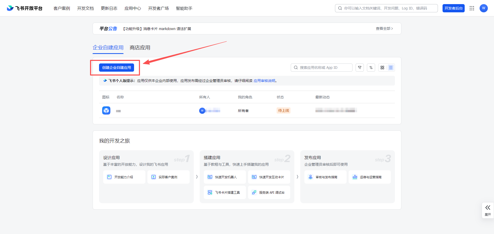
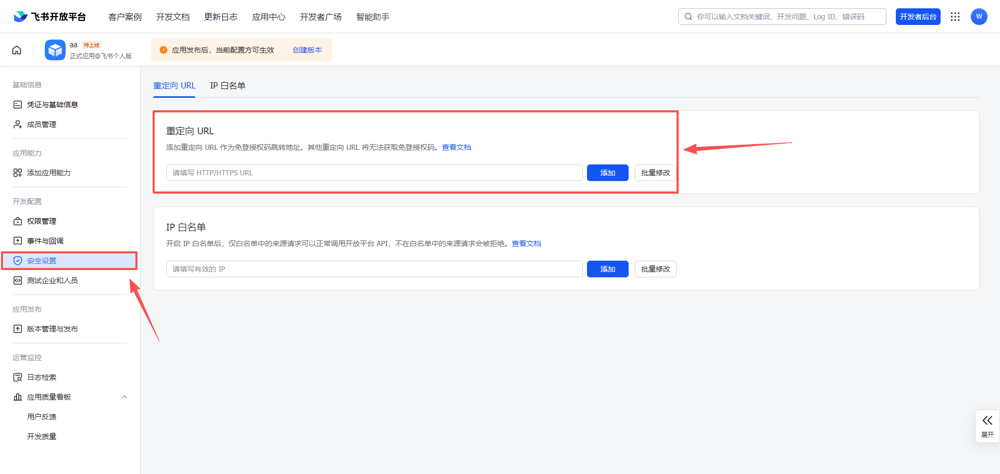
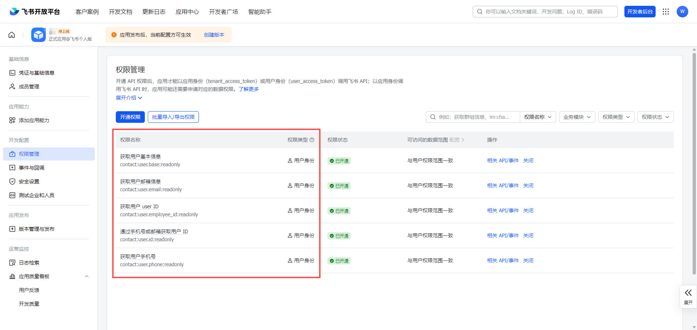
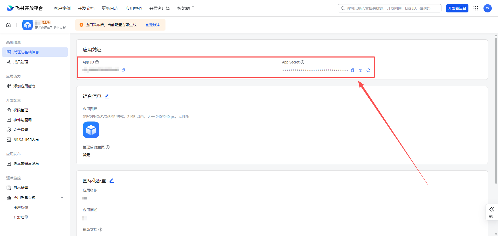

# 飞书

用于接入飞书开放平台 OAuth 登录。

## 申请步骤

1. 注册或登录 [飞书](https://www.feishu.cn/accounts/page/ug_register)。
2. 进入 [飞书开放平台](https://open.feishu.cn/) 控制台。

   

3. 创建应用。

   

4. 配置回调地址。

   

5. 配置所需权限。

   

6. 记录应用密钥。

   

## 集成需要

- `Client ID`
- `Client Secret`
- `重定向 URL`
