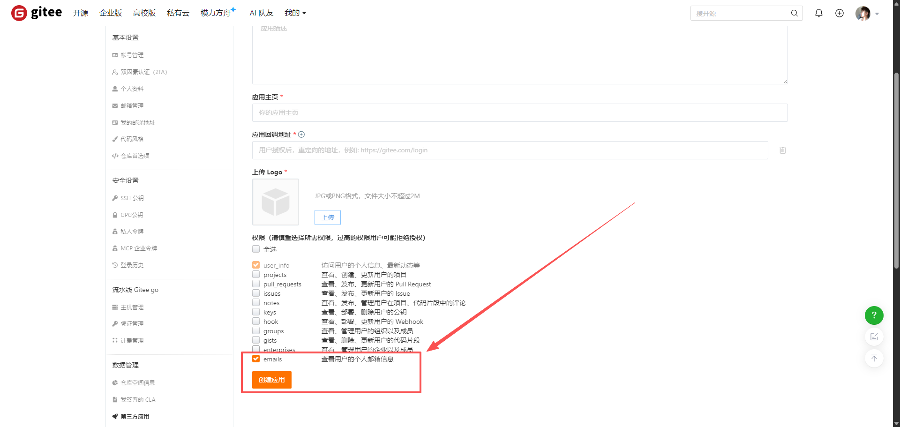

## 注册账号

地址：[Gitee](https://gitee.com/)

如果已有则忽略该步骤，直接进入第二步

## 创建第三方应用

### 登录

登陆已注册的账号，通过主页右上角进入个人设置页

### 创建应用

进入第三方应用界面

创建应用

信息输入完成后，点击创建应用

!!! warning

    切记勾选 `emails` 选项

### 获取密钥

创建完成后，页面将自动刷新并创建密钥

记录 `Client ID`、`Client Secret`、`应用回调地址`，这三个东西在我们集成的时候都用得到，请妥善保管 `Client ID` 和
`Client Secret`