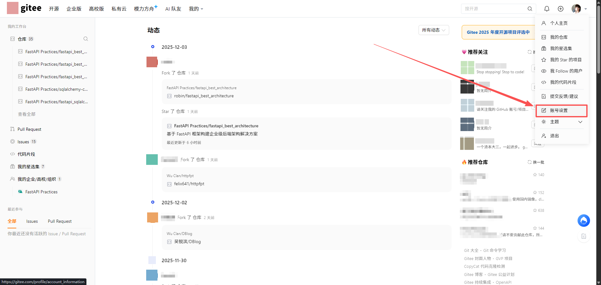
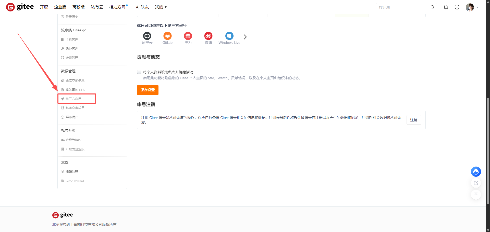
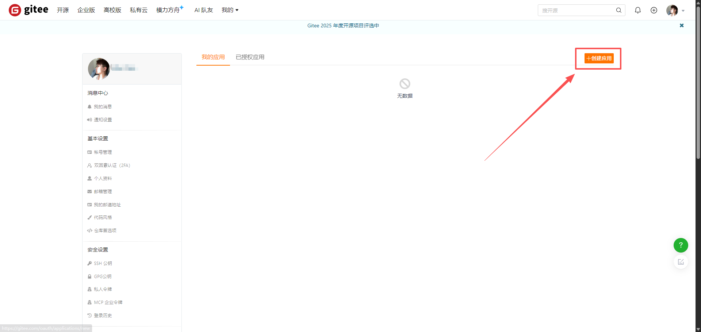
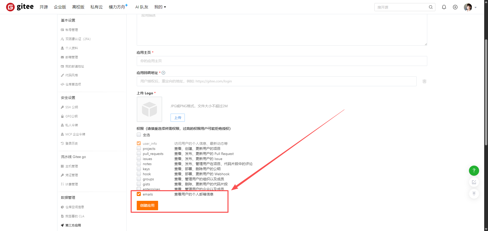
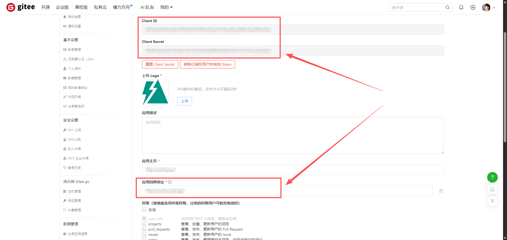

# Gitee

用于接入 Gitee 第三方登录。

## 申请步骤

1. 登录 [Gitee](https://gitee.com/)，进入个人设置页。

   

2. 进入第三方应用页面。

   

3. 创建应用。

   

4. 填写应用信息并提交。

!!! warning

    如需获取邮箱，请勾选 `emails` 权限。

   

5. 创建完成后记录密钥。

   

## 集成需要

- `Client ID`
- `Client Secret`
- `应用回调地址`
