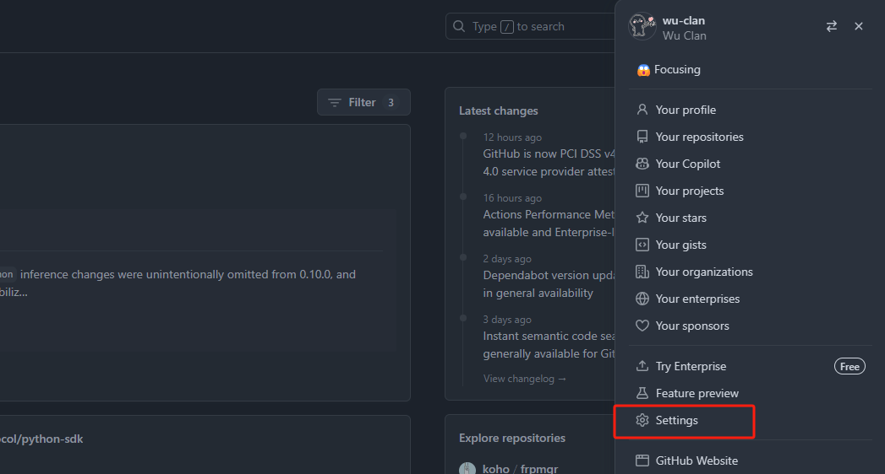
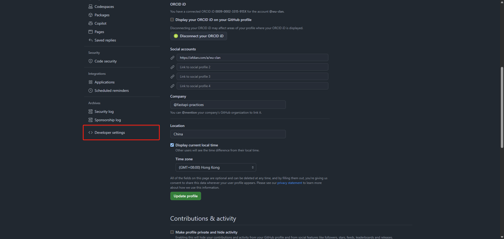
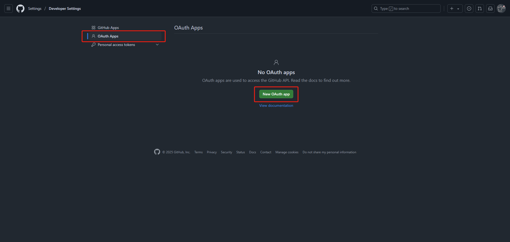
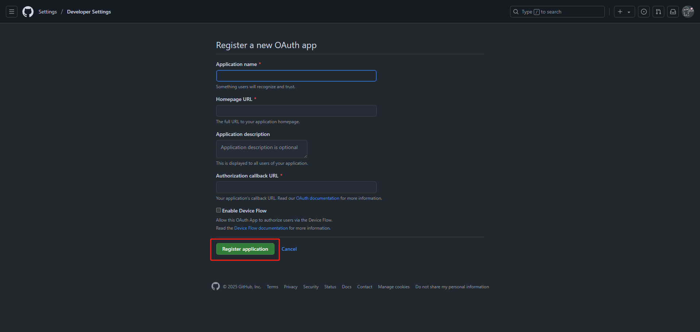
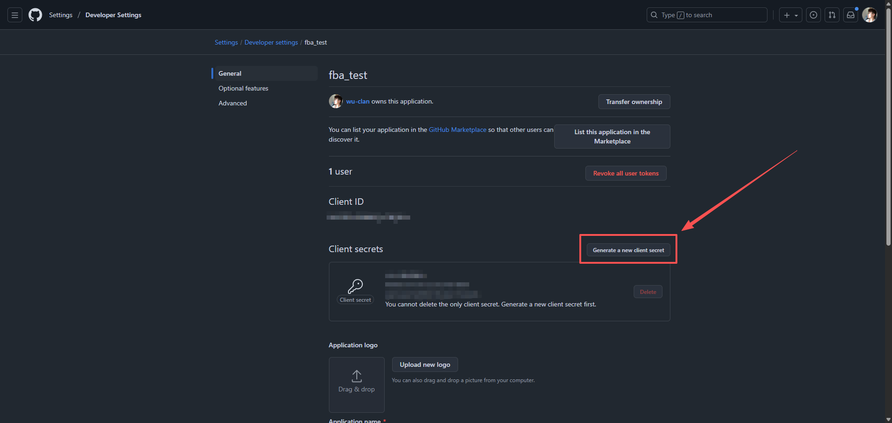

## 注册账号

地址：[GitHub](https://github.com/)

如果已有则忽略该步骤，直接进入第二步

## 创建第三方应用

### 登录

登录已注册的账号，通过主页右上角进入个人设置页：[profile](https://github.com/settings/profile)

### 创建应用

进入开发者界面：[Developer settings](https://github.com/settings/apps)

创建 OAuth app：[OAuth apps](https://github.com/settings/developers)

- `Application name` 填写自己的网站名称
- `Homepage URL` 填写自己的网站首页地址
- `Application description` 填写自己的应用描述
- `Authorization callback URL` 用户授权后跳转到自己平台的地址。通常情况下，开发者需要在此路由代码中实现自己平台用户的注册、绑定等操作
- `Enable Device Flow` 不需要勾选

信息输入完成后，点击下方绿色的 ==`Register applaction`== 按钮创建应用

### 创建密钥

创建完成后，进入应用详情页，`Client secrets`

创建完成后，记录 `Client ID`、`Client Secret`、`Authorization callback URL`，这三个东西在我们集成的时候都用得到，请妥善保管
ID 和 Secret
