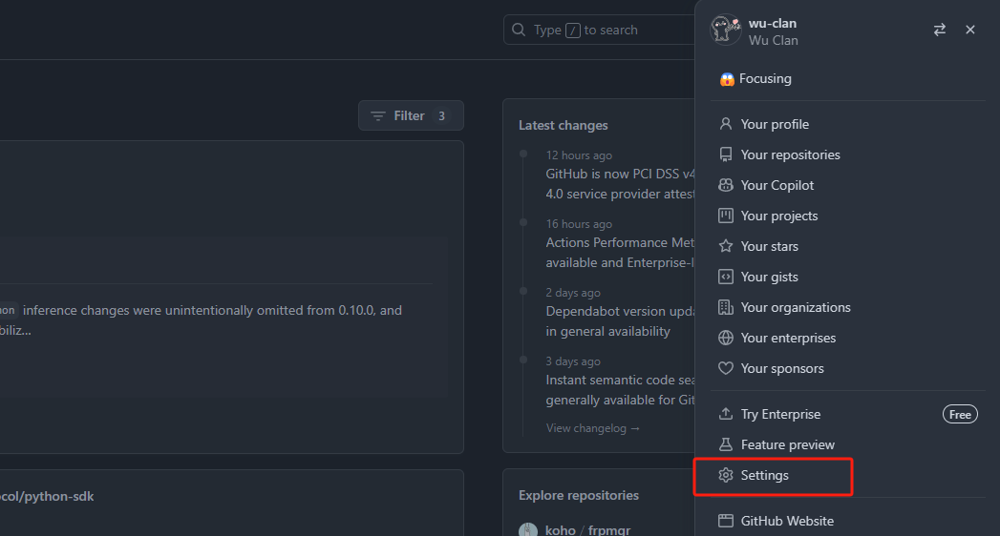
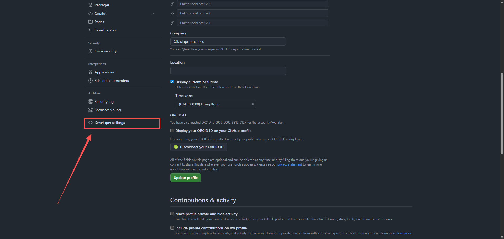
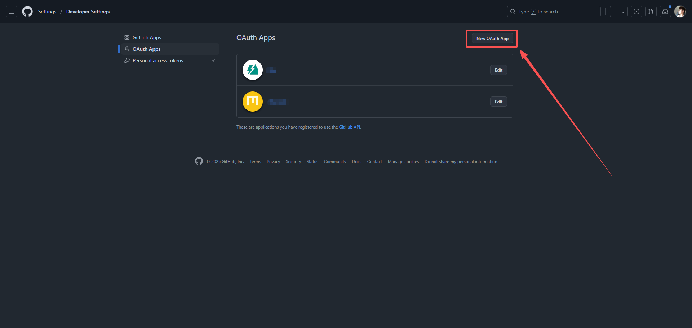
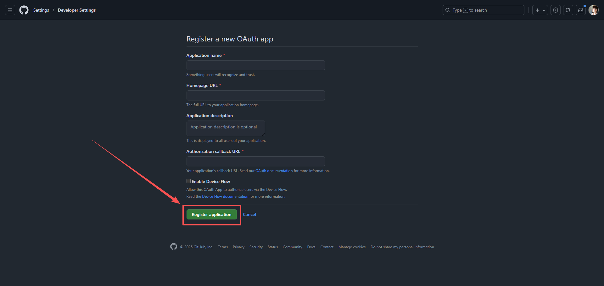
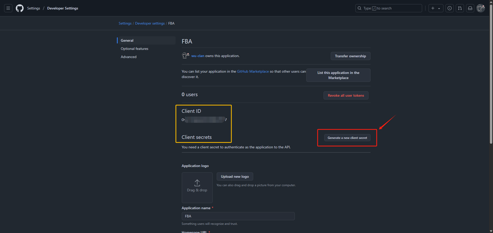

# GitHub

用于接入 GitHub OAuth App 登录。

## 申请步骤

1. 登录 [GitHub](https://github.com/)，进入个人设置页。

   

2. 进入开发者设置。

   

3. 创建 OAuth App。

   

4. 填写应用信息：

   - `Application name`：应用名称
   - `Homepage URL`：应用首页
   - `Application description`：应用描述
   - `Authorization callback URL`：授权回调地址，例如 `http://localhost:8000/auth/github/callback`
   - `Enable Device Flow`：通常不需要勾选

5. 提交创建。

   

6. 在应用详情页创建并记录密钥。

   

## 集成需要

- `Client ID`
- `Client Secret`
- `Authorization callback URL`
