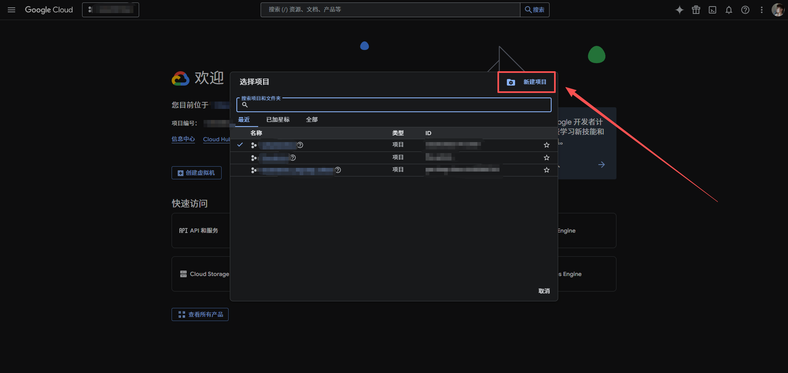

## 创建第三方应用

### 登录

登录 Google 开发者中心：[console.developers.google](https://console.developers.google.com/apis/dashboard)

### 创建项目

创建凭据

信息输入完成后，点击创建应用

### 获取密钥

创建完成后，页面将自动刷新并创建密钥

记录 `客户端ID`、`客户端密钥`、`重定向 URI`，这三个东西在我们集成的时候都用得到，请妥善保管 `客户端ID` 和 `客户端密钥`
