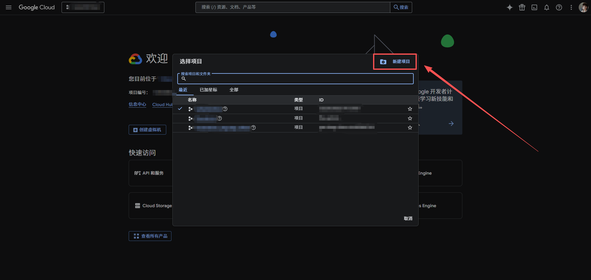
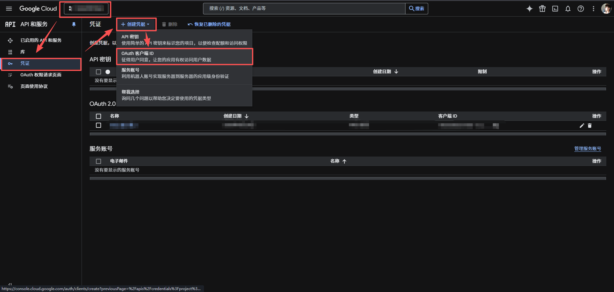
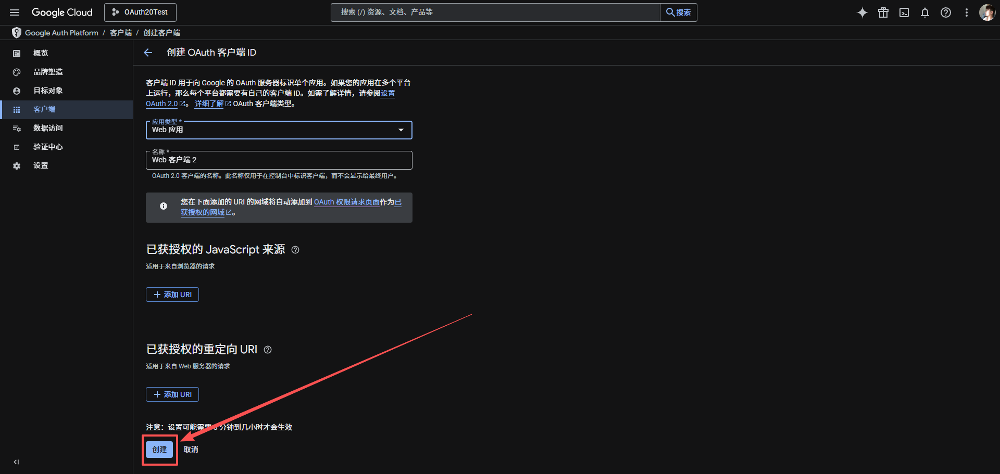
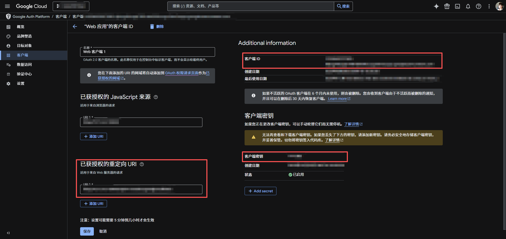

# Google

用于接入 Google OAuth 2.0 登录。

## 申请步骤

1. 登录 [Google 开发者中心](https://console.developers.google.com/apis/dashboard)。
2. 创建或选择项目。

   

3. 创建 OAuth 客户端凭据。

   

4. 填写应用信息和重定向 URI。

   

5. 创建完成后记录密钥。

   

## 集成需要

- `客户端 ID`
- `客户端密钥`
- `重定向 URI`
