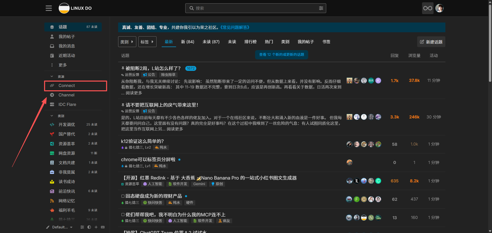
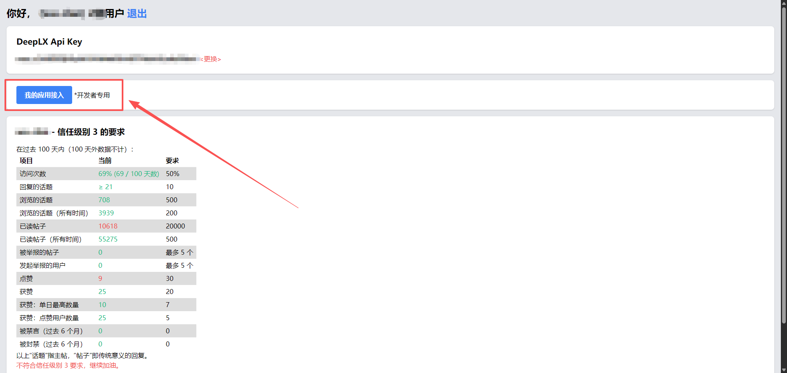
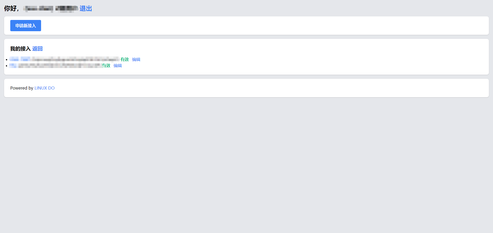
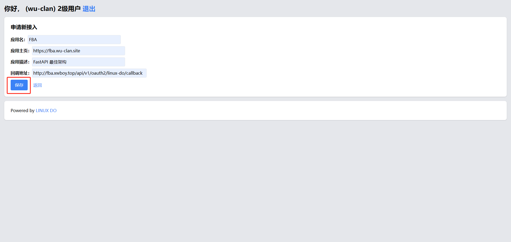
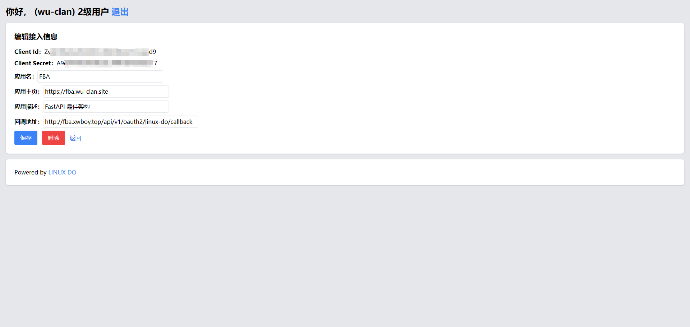

# LinuxDo

用于接入 LinuxDo Connect 登录。

## 申请步骤

1. 登录 [LinuxDo](https://linux.do/)，从左侧进入 Connect 页面。

   

2. 进入开发者页面。

   

3. 申请新接入。

   

4. 填写信息并保存。

   

5. 在应用详情页记录密钥。

   

## 集成需要

- `Client ID`
- `Client Secret`
- `回调地址`
