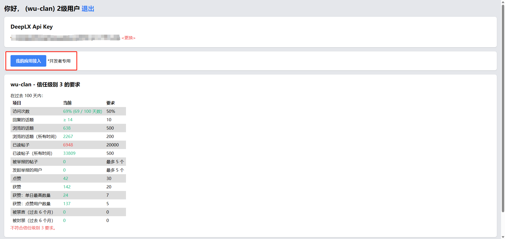
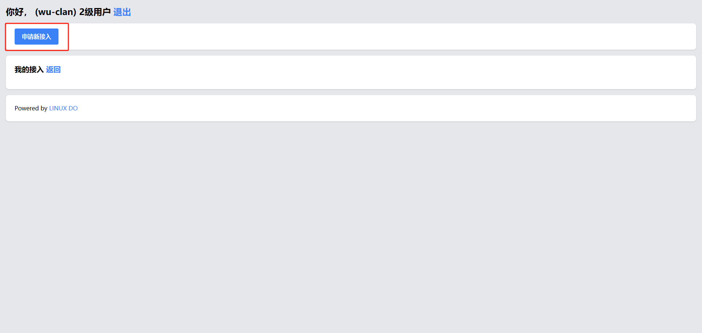

## 注册账号

地址：[LinuxDo](https://linux.do/)

如果已有则忽略该步骤，直接进入第二步

## 创建第三方应用

### 登录

登录已注册的账号，通过主页左侧 Connect 进入 connect 页面：[connect](https://connect.linux.do/)

### 创建应用

进入开发者界面：[sso](https://connect.linux.do/dash/sso)

申请新接入：[new](https://connect.linux.do/dash/sso/new)

信息输入完成后，点击下方蓝色的 ==`保存`== 按钮创建应用

创建完成后，进入应用详情页

记录 `Client ID`、`Client Secret`、`回调地址`，这三个东西在我们集成的时候都用得到，请妥善保管 ID 和 Secret
