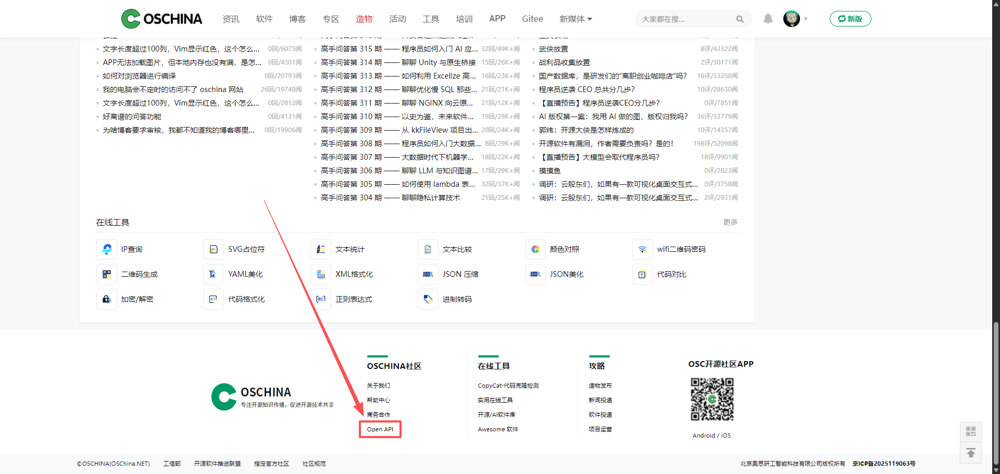
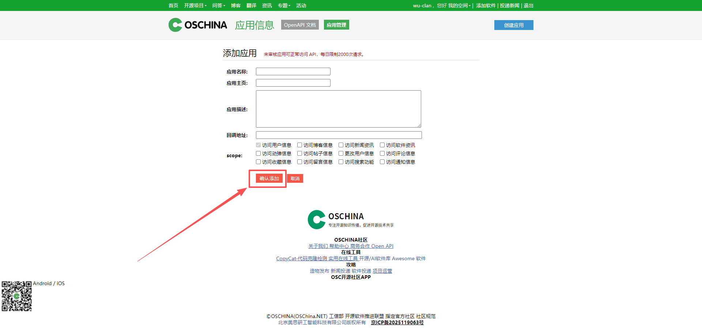
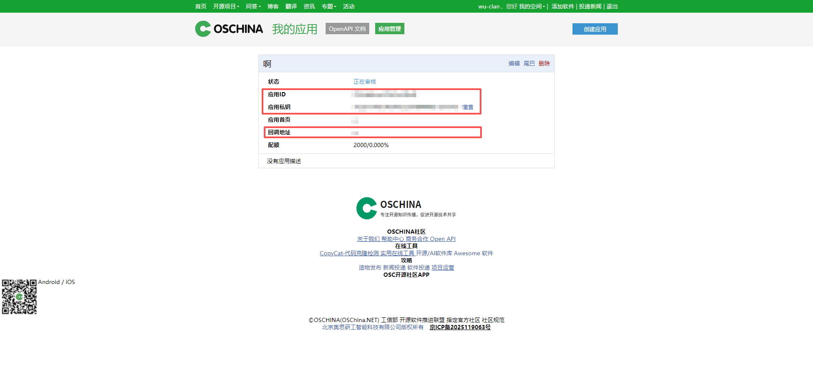

## 注册账号

地址：[oschina](https://www.oschina.net/)

如果已有则忽略该步骤，直接进入第二步

## 创建第三方应用

### 登录

登录已注册的账号，通过页脚进入文档页

### 创建应用

信息输入完成后，点击确认添加

### 获取密钥

创建完成后，页面将自动刷新并创建密钥

记录 `应用ID`、`应用私钥`、`回调地址`，这三个东西在我们集成的时候都用得到，请妥善保管 应用ID 和 应用私钥