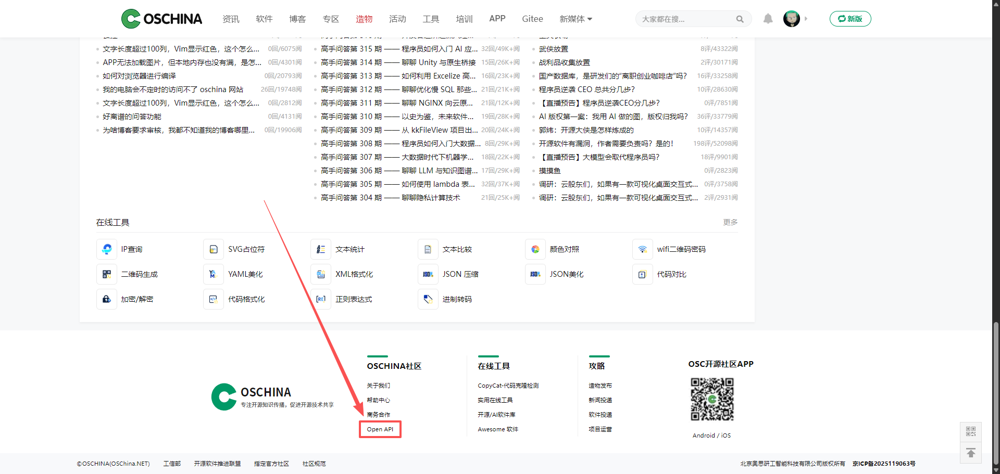
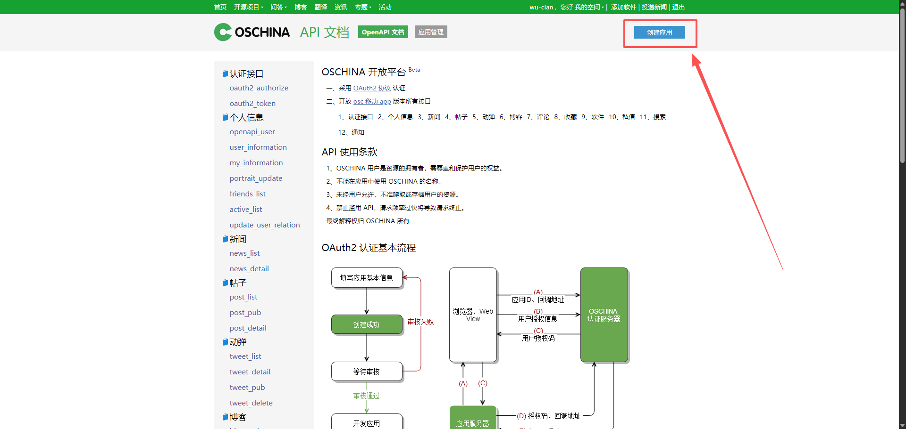
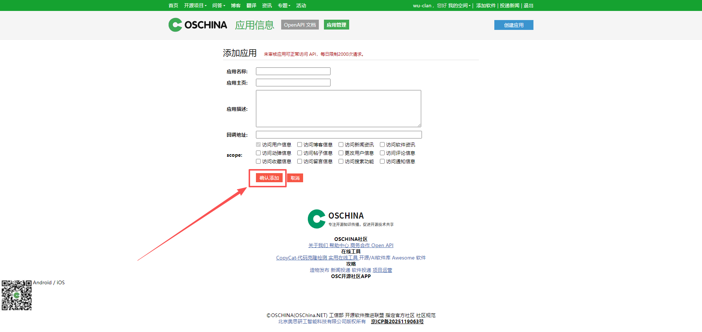
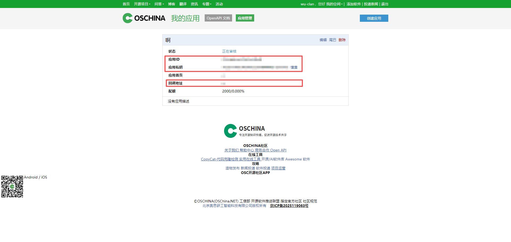

# 开源中国

用于接入 OSChina 第三方登录。

## 申请步骤

1. 登录 [开源中国](https://www.oschina.net/)。
2. 从页脚进入开放平台或文档入口。

   

3. 创建应用。

   

4. 填写信息并确认添加。

   

5. 创建完成后记录密钥。

   

## 集成需要

- `应用 ID`
- `应用私钥`
- `回调地址`
